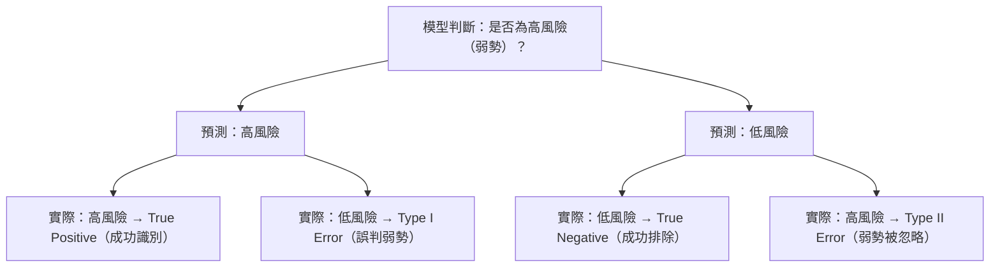

# 🛳 Titanic 生存分析：在壓力情境下建立可支撐決策的資料框架

這個專案不是在「猜誰會活下來」，而是在回答一個更接近真實決策的問題：
  
> 我要如何用資料判斷「誰必須優先救援」，誰的成功率低到可能被迫放棄？**

我把 Titanic 當成一個 decision problem，而不是純 machine learning problem：

Titanic 資料反映的是「最終誰比較容易存活」，  
因此本專案的目標是 **識別高風險（弱勢）族群**，而不是模擬救援決策。

在這類風險分類問題中，錯誤成本不對稱：

- **Type I（False Positive｜誤判為高風險）**  
  成本：資源分散，但後果有限。

- **Type II（False Negative｜誤判為低風險）**  
  成本：真正弱勢族群被忽略，存活機率大幅下降。  
  → **此錯誤最不可接受。**

本分析的核心目標是：

> **降低 Type II Error，找出真正的高風險族群。**

## ⚠️ Error Trade-off（風險識別）

綜合 EDA 與模型結果，可以用一句話描述決策規則：

> **低艙等（Pclass=3）＋ 成年男性 ＋ 單人或大家庭 ＋ 低票價 → 最高風險，應優先救援。**  
> **高艙等＋ 女性或兒童 ＋ 小家庭（2–4 人）＋ 較高票價 → 相對安全，可較晚處理。**

透過 User Story → EDA → Feature Engineering → Model Validation，  
我最後找出四個最關鍵的決策因子：

1. **價值階層（Pclass / Fare）**  
2. **族群特徵（Sex / Age）**  
3. **家庭結構（FamilySize）**  
4. **市場差異（Embarked）**

雖然這是乾淨的資料集，但是分析邏輯，可以遷移到實際商業場景，例如：轉換率、留存率、風險評分。

---

## 👤 User Story

情境設定：

- 船艙進水，救生艇數量有限  
- 你是負責決策的主管  
- 你必須在極短時間內決定：**誰一定要救？誰可以等？誰很可能來不及？**

你僅能使用的資訊：

- Sex（性別）  
- Pclass（艙等）  
- Fare（票價）  
- Age（年齡）  
- FamilySize（家庭大小）  

---

# 📌 問題定義

將決策邏輯拆成三個明確問題：

### **Q1｜哪些變數對成功率（生存）影響最大？**
→ 找出高風險 / 低風險的主要 driver。

### **Q2｜是否存在明顯的交互效應？**
→ 例如艙等 × 性別是否形成不同風險族群。

### **Q3｜能否形成一條簡潔、可重複使用的 decision rule？**
→ 壓力情境下也能採用。

---

# 🎯 三個問題的答案

### **A1｜關鍵變數包括 Sex、Pclass、Fare、Age、FamilySize。**
它們持續在 EDA、Logistic Regression、Random Forest 中呈現高解釋力。

### **A2｜最關鍵的交互效應是「艙等 × 性別」。**
- 1 等艙女性 → 幾乎全部生存（非常低風險）  
- 3 等艙男性 → 生存率最低（高度高風險）  

其次是：
- Age × FamilySize：有小孩的小家庭成功率明顯較高。

### **A3｜可以用上述 driver 建構出可落地的 decision rule。**

> **高艙等＋女性/兒童＋小家庭 → 可自行應對**  
> **低艙等＋成年男性＋單人/大家庭 → 高風險，需優先救援**

這條規則簡潔、可重複、可擴展到其他商業場景（如流失風險判斷）。

---

# 📊 支撐洞察的圖表

### 1. Age Distribution  

### 2. Age vs Fare vs Pclass  

### 3. Survival Rate by Age & Sex  

### 4. Survival Rate by Class and Sex  

### 5. Survival Rate by Family Size  

### 6. Survival Rate by Class and Sex (Seaborn)  

### 7. Survival Rate by Family Size (Seaborn)  

### 8. Feature Importance  

---

# 🔍 分析方法

這部分展示我在解決問題時的結構化思考，而不是把 Titanic 當 Kaggle 題目在做。

## 1️⃣ 建立假設

資料還沒看之前先假設：

- 高艙等與高票價 = 資源取得優勢  
- 女性、小孩 = 社會規範優先照顧  
- 小家庭 = 協同行為效率較高  
- 登船地差異 = 不同 socio-economic segment  

---

## 2️⃣ EDA：辨識「真的有訊號」的變數

使用描述統計 + 可視覺化檢查每個特徵：

- Sex：女性生存率遠高於男性  
- Pclass/Fare：價格與階層差異非常明顯  
- Age：兒童成功率高，年齡越大越不利（男性尤其顯著）  
- FamilySize：2–4 人的小家庭成功率最高  
- Embarked：不同港口代表不同市場結構  

結論：這些變數具有穩定訊號，值得做成特徵。

---

## 3️⃣ Feature Engineering

把邏輯概念具象化成模型可用的特徵：

- `FamilySize = SibSp + Parch + 1`  
- Sex → 0/1  
- Embarked → one-hot encoding（避免錯誤排序）  
- Age, Fare → 以中位數補缺失  
- Cabin → 缺失過高，捨棄  

這一步確保模型建立在邏輯，而不只是跑演算法。

---

## 4️⃣ Model Validation（Logistic Regression + Random Forest）

使用兩種模型交叉驗證洞察：

### ✔ Logistic Regression  
確認各特徵的影響方向（正向、負向），並檢查是否符合行為邏輯。

### ✔ Random Forest  
確認特徵重要性排名，檢查非線性特徵與交互效果。

兩者結果一致：  
Sex、Pclass、Fare、Age、FamilySize 是真正的主因子。

---

## 📍 結語：從資料到決策的可複製框架

透過結構化分析，我將 Titanic 轉化為一個風險分類問題，
並成功找出能穩定識別弱勢族群的核心因子（Sex、Pclass、Fare、Age、FamilySize）。

最終展示：
	•	資料確實呈現穩定的結構性差異
	•	弱勢族群可以被有效識別
	•	模型驗證支持洞察並降低 Type II Error
	•	整套方法可遷移到真實商業場景

這個框架具有可重複性、可解釋性，
適用於任何需要優先排序、弱勢識別、或資源分配的決策任務。
