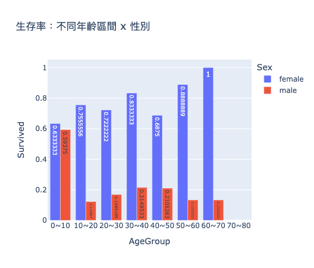
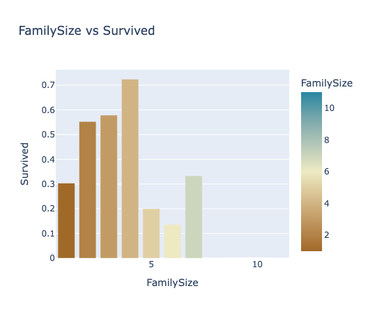
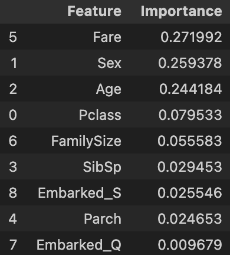

# 🛳 Titanic 生存分析：在壓力情境下建立可支撐決策的資料框架

本專案不是在預測「誰會生存」，而是建立一套在資訊有限情況下仍能清楚識別弱勢族群的決策框架。

Titanic 資料揭示的是：

在相同環境下，不同族群的生存率差異極大。

因此核心問題是：
哪些族群天然處於高風險？我們能否有效識別？

這類問題廣泛存在於商業場景：
用戶流失、信用風險、轉換率、客群分層、資源分配。

分析結果顯示，高風險族群具有清楚且一致的結構性特徵：

高風險（弱勢）族群

低艙等（Pclass=3）＋ 成年男性 ＋ 單人 / 大家庭 ＋ 低票價

低風險（具優勢）族群

高艙等（Pclass=1）＋ 女性 / 兒童 ＋ 小家庭（2–4 人）＋ 高票價

這些差異在 EDA、Logistic Regression、Random Forest 中皆一致。

結論：

風險並非隨機，而是由少數核心因子系統性決定。

核心洞察：錯誤成本不對稱（風險識別問題）

在任何風險分類場景，錯誤成本都不同：
	•	Type I｜誤判高風險 → 資源被分散，但影響有限
	•	Type II｜誤判低風險 → 弱勢未獲關注，後果嚴重

因此決策原則是：

優先降低 Type II Error，確保弱勢族群不被忽略。

'''mermaid
flowchart TD

    A["模型判斷：是否為高風險（弱勢）？"] --> B1["預測：高風險"]
    A --> B2["預測：低風險"]

    B1 --> C1["實際：高風險 → True Positive（成功識別）"]
    B1 --> C2["實際：低風險 → Type I Error（誤判弱勢）"]

    B2 --> C3["實際：低風險 → True Negative（成功排除）"]
    B2 --> C4["實際：高風險 → Type II Error（弱勢被忽略）"]

'''
綜合 EDA 與模型結果，可形成一條非常簡潔的決策規則：

***低艙等（Pclass=3）＋ 成年男性 ＋ 單人/大家庭 ＋ 低票價 → 高風險（弱勢）。
高艙等＋ 女性/兒童 ＋ 小家庭（2–4 人） → 明顯優勢（低風險）。***

四大高風險決定因子（Key Drivers）

透過 User Story → EDA → Feature Engineering → Model Validation，我找出四個主因子：
	1.	價值階層（Pclass / Fare）
	2.	族群特徵（Sex / Age）
	3.	家庭結構（FamilySize）
	4.	市場差異（Embarked）

雖然 Titanic 是乾淨資料集，但整套方法可直接遷移到：
	•	用戶轉換率
	•	留存/流失分析
	•	風險評分模型
	•	客群分層策略
---

## 👤 User Story

情境設定：

- 船艙進水，救生艇數量有限  
- 你是負責決策的主管  
- 你必須在極短時間內決定：**誰一定要救？誰可以等？誰很可能來不及？**

你僅能使用的資訊：

- Sex（性別）  
- Pclass（艙等）  
- Fare（票價）  
- Age（年齡）  
- FamilySize（家庭大小）  

---

# 📌 問題定義

將決策邏輯拆成三個明確問題：

### **Q1｜哪些變數對成功率（生存）影響最大？**
→ 找出高風險 / 低風險的主要 driver。

### **Q2｜是否存在明顯的交互效應？**
→ 例如艙等 × 性別是否形成不同風險族群。

### **Q3｜能否形成一條簡潔、可重複使用的 decision rule？**
→ 壓力情境下也能採用。

---

# 🎯 三個問題的答案

### **A1｜關鍵變數包括 Sex、Pclass、Fare、Age、FamilySize。**
它們持續在 EDA、Logistic Regression、Random Forest 中呈現高解釋力。

### **A2｜最關鍵的交互效應是「艙等 × 性別」。**
- 1 等艙女性 → 幾乎全部生存（非常低風險）  
- 3 等艙男性 → 生存率最低（高度高風險）  

其次是：
- Age × FamilySize：有小孩的小家庭成功率明顯較高。

### **A3｜可以用上述 driver 建構出可落地的 decision rule。**

> **高艙等＋女性/兒童＋小家庭 → 可自行應對**  
> **低艙等＋成年男性＋單人/大家庭 → 高風險，需優先救援**

這條規則簡潔、可重複、可擴展到其他商業場景（如流失風險判斷）。

---

# 📊 支撐洞察的圖表

### 1. Age Distribution  

### 2. Age vs Fare vs Pclass  

### 3. Survival Rate by Age & Sex  

### 4. Survival Rate by Class and Sex  

### 5. Survival Rate by Family Size  

### 6. Survival Rate by Class and Sex (Seaborn)  

### 7. Survival Rate by Family Size (Seaborn)  

### 8. Feature Importance  

---

# 🔍 分析方法

這部分展示我在解決問題時的結構化思考，而不是把 Titanic 當 Kaggle 題目在做。

## 1. 建立假設

資料還沒看之前先假設：

- 高艙等與高票價 = 資源取得優勢  
- 女性、小孩 = 社會規範優先照顧  
- 小家庭 = 協同行為效率較高  
- 登船地差異 = 不同 socio-economic segment  

---

## 2. EDA：辨識「真的有訊號」的變數

使用描述統計 + 可視覺化檢查每個特徵：

- Sex：女性生存率遠高於男性  
- Pclass/Fare：價格與階層差異非常明顯  
- Age：兒童成功率高，年齡越大越不利（男性尤其顯著）  
- FamilySize：2–4 人的小家庭成功率最高  
- Embarked：不同港口代表不同市場結構  

結論：這些變數具有穩定訊號，值得做成特徵。

---

## 3. Feature Engineering

把邏輯概念具象化成模型可用的特徵：

- `FamilySize = SibSp + Parch + 1`  
- Sex → 0/1  
- Embarked → one-hot encoding（避免錯誤排序）  
- Age, Fare → 以中位數補缺失  
- Cabin → 缺失過高，捨棄  

這一步確保模型建立在邏輯，而不只是跑演算法。

---

## 4. Model Validation（Logistic Regression + Random Forest）

使用兩種模型交叉驗證洞察：

### ✔ Logistic Regression  
確認各特徵的影響方向（正向、負向），並檢查是否符合行為邏輯。

### ✔ Random Forest  
確認特徵重要性排名，檢查非線性特徵與交互效果。

兩者結果一致：  
Sex、Pclass、Fare、Age、FamilySize 是真正的主因子。

---

# 結語：從資料到決策的可複製框架

透過結構化分析，我將 Titanic 轉化為一個典型的風險分類問題，並找出能穩定預測弱勢族群的核心因子（Sex、Pclass、Fare、Age、FamilySize）。  

最終結果展示：

- 資料中確實存在穩定的結構性差異  
- 弱勢族群可以被有效識別  
- 模型驗證支持洞察，避免 Type II Error  
- 分析方法能遷移到實際商業場景（轉換率、留存、風險評分）

這套框架具可重複性、可解釋性，且適用於任何需要優先排序、弱勢識別、或資源分配的決策情境。

